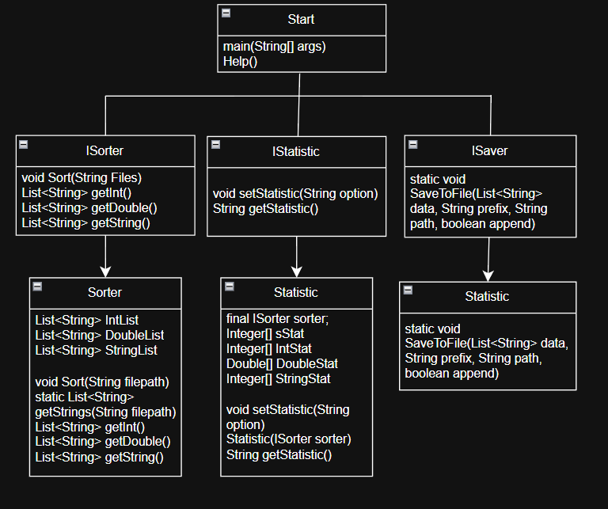

# Shift_TestTaskJava
Тестовое задание для отборочного этапа на курс SHIFT Java.
Описание работы утилиты.

На изображении диаграма классов для проекта. 

### **Гайд**

Для запуска утилиты необходимо запустить jar архив 
командой -jar FileName.jar
Далее указать дополнительные опции, пути к входным 
файлам через пробел и без кавычек, если файл в директории с архивом то указать только имя с учетом расширения. 
Принимаются только txt файлы.
При успешном завершении в консоль выведется: Успех.

### **Версии**
* Версия java: 25.
* Система сборки: Maven. Версия 4.0.0 

Внешних библиотек не использовалось

### **Дополнительные опции:**
* [-p \<option>] - Задание префикса имен выходных файлов. 
* [-o \<option>] - Задание пути сохранения результатов
* [-a] - Включить режим дозаписи существующих файлов. По умолчанию файлы пересоздаются.
* [-s] - Короткую статистика: количество записаных элементов
* [-f] - Полная статитстика: короткая + минимальные/максимальные числа, среднее, сумма; Для строк макс./мин. Длина строки

### **Примеры** (В фигурных скобках содержание файлов )

test.txt {

123

-1.1

Hello World!

}

**Вход** 

java -jar start.jar -a -o C:\Users\Public -p simple_ test.txt

**Выход** 

C:\Users\Public\simple_Integers.txt { 123 }

C:\Users\Public\simple_Double.txt { 123 }

C:\Users\Public\simple_String.txt { Hello World! }